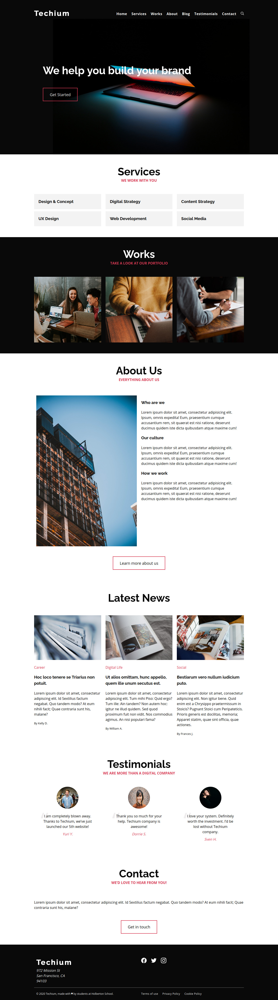

# 0x06. Responsive design

# Description
Collection of tasks to learn how to make a website responsive on multiple devices.

## Learning Objectives
- Mobile-first design
- Media-queries
- Sizes to use for responsive web design
- How to make a website responsive
- The differences between responsive and adaptive design
- CSS units that are used to make elements flexible

## Results

## Author
* **Sebagadis Kahsay** - [sebagadisk](https://github.com/sebagadisk)
